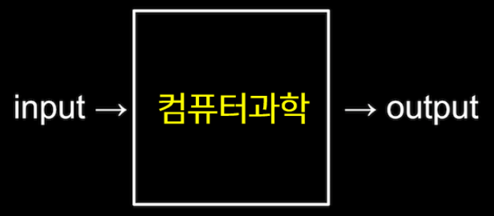
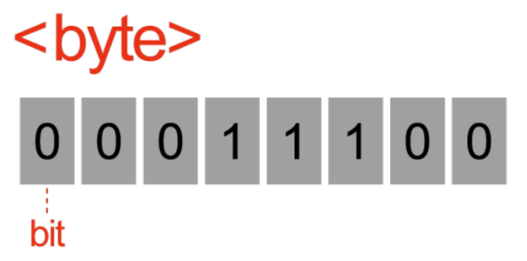
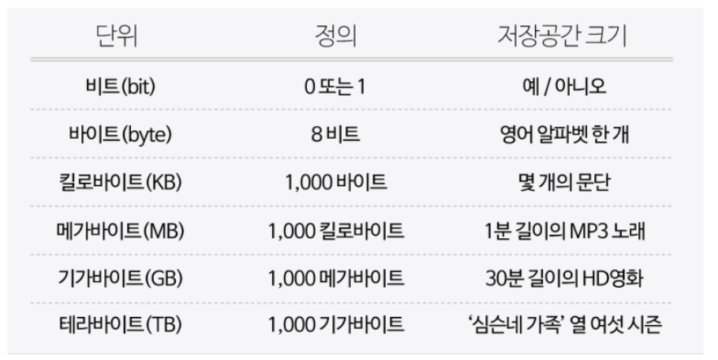
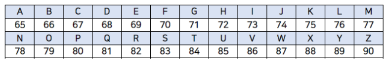
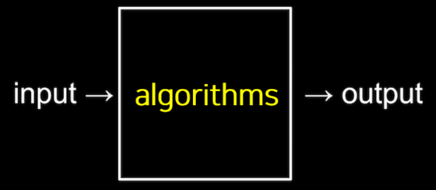

# Computational Thinking

Computer Science?
- 문제 해결에 대한 학문
문제 해결?
- 입력(input)을 전달받아 출력(output)을 만들어내는 과정 like Function

## 1. Binary (2진법)
- 컴퓨터에서 입력과 출력을 표현하는 방법은 2진법
- 오직 0과 1로만 데이터를 표현
### Bit (비트)
- 2진법에서 하나의 자릿수를 표헌하는 단위
- 정보를 저자하고 연산을 수행하기 위한 측정 단위
### Byte (비트열)
- 하나의 비트는 0과 1, 두가지 값만 저장할 수 있다. 이러한 비트가 8개 모여 비트열을 만들면 byte(바이트)이다.
- 즉, 하나의 byte에 8개의 bit가 있고, 하나의 비트는 2가지로 표현되기 때문에(0과 1) 1byte는 2^8 = 256개를 표현할 수 있다.

## 2. 정보의 표현
Binary로 어떠한 숫자든지 표현할 수 있지만 문자는 어떻게 표현할까?
### 문자의 표현
ASCII(아스키코드): 문자를 숫자로 표현하기 위한 약속
- 총 128개의 부호로 정의되어있다.

Unicode: 더 많은 비트를 사용하여 더 다양한 다른 문자들의 표현을 약속
- 이모티콘도 가능하다. 😂(기쁨의 눈물): 128514, 11111011000000010

그림, 영상, 음악 역시 숫자로 표현할 수 있다.
- 그림, 영상은 pixel로 이루어져 있고, pixel은 R, G, B의 합이다.
- 음악도 각 음표를 숫자로 표현

## 3. Algorithm
어떻게 input해야 원하는 output을 얻을 수 있을까? **Algorithm**
- 알고리즘은 **input에서 받은 자료를 output 형태로 만드는 처리과정**
- 입력값을 출력값의 형태로 바꾸기 위해 어떤 명령들이 수행되어야 하는지에 대한 **규칙들의 순서적 나열**

### 정확한 알고리즘
- 정확성과 효율성이 중요하다
- 정확성은 원하는 output을 얻었는가
- 효율성은 작업을 완료하기까지 얼마나 시간과 노력을 덜 들이는가
- 전화번호부에서 '최보혜'를 찾을 때, ㄱ-ㅎ순으로 찾으면 정확성은 높지만 시간과 노력이 많이 필요하기 때문에 비효율적이다. 하지만 책의 절반을 펴쳤을 때, 'ㅂ'이였다면 앞부분은 버리고 뒷부분만 확인!(벌써 절반이 줄었다.)
  - 첫 번째 알고리즘은 한 장을 넘긴 다음 또 한 장 넘기는 규칙들의 순서적 나열
  - 두 번째 알고리즘은 반을 줄이고, 다음 또 반을 줄이는 규칙들의 순서적 나열
  - ps. 이러한 생각이 매우 기본적이고 쉬워보이는데 알고리즘 문제를 직접 풀다보면 잘 떠오르지 않는다...휴..
### Pseudocode
필요한 행동이나 조건을 잘 설정하여 컴퓨터가 수행해야하는 일을 절차적으로 파악할 수 있게 만들어준다.
